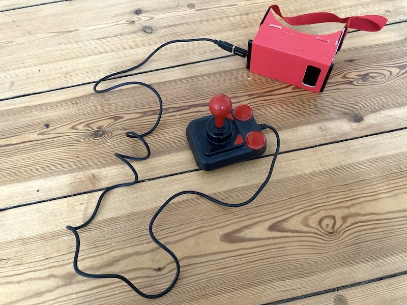

# A-Frame Gamepad example

WORK IN PROGRESS

Example, demonstrating a USB Gamepad in [A-Frame](https://aframe.io/). Live at https://i3games.github.io/aframe-gamepad/

I use an Speed Link SL 6603 to interact with the scene. This USB Joystick works also works with my Android device, other devices don't.

MIT License 

## Third-Party Licenses

Image credits: kin design         
A-Frame authors    
